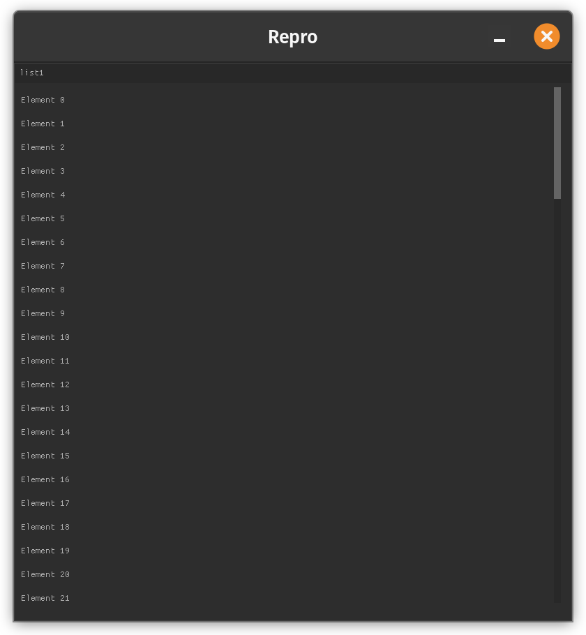
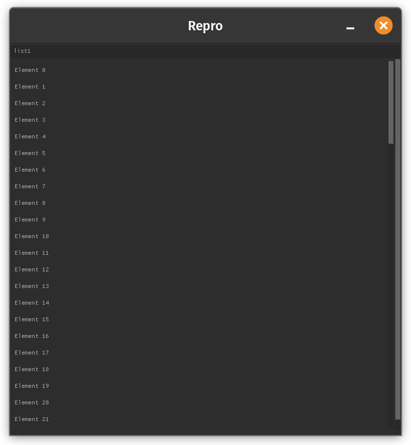

Method : 

1. I created the v1 folder that works perfectly, it is just one main.c (plus the nk files), it has a `void render_widget_list(struct nk_context **ctx, int win_width, int win_height)` that renders a list widget

2. Then I created the ve folder as a copy pasted one from the v1 and just moved the exact same `render_widget_list` function to another file `gui.c` (with its `gui.h` header file)

Now the problem is that the two dont render the same, moving the function to a different file adds, for some reason, an additional unprompted outter scrollbar

Am I missing something ?
Please help

